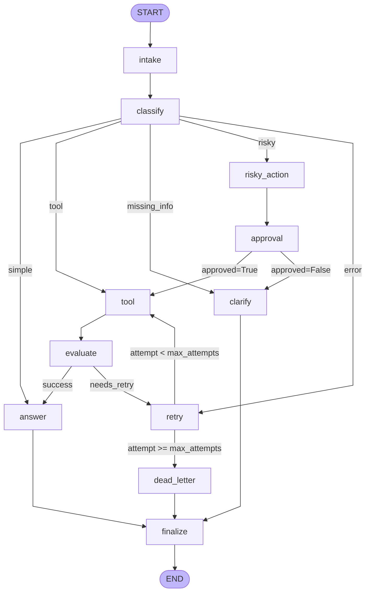

# LangGraph Agent — Architecture Diagram

Generated via `graph.get_graph()` from the compiled `CompiledStateGraph`.

## Node descriptions

| Node | Role |
|------|------|
| `intake` | Normalizes query, sets metadata |
| `classify` | Keyword-based routing (risky > tool > missing_info > error > simple) |
| `answer` | Generates final response, grounded in tool_results |
| `tool` | Mock tool execution (order lookup, etc.) — idempotent |
| `evaluate` | Checks tool_results for errors → `needs_retry` or `success` |
| `clarify` | Asks user for missing information |
| `risky_action` | Prepares risky action for approval |
| `approval` | HITL approval gate (mock default; real interrupt via `LANGGRAPH_INTERRUPT=true`) |
| `retry` | Increments attempt counter, logs retry |
| `dead_letter` | Logs unresolvable failures for manual review |
| `finalize` | Emits final audit event, terminates all paths |
